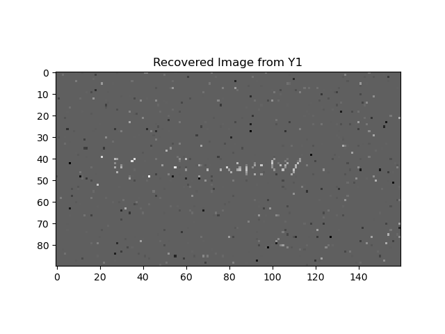
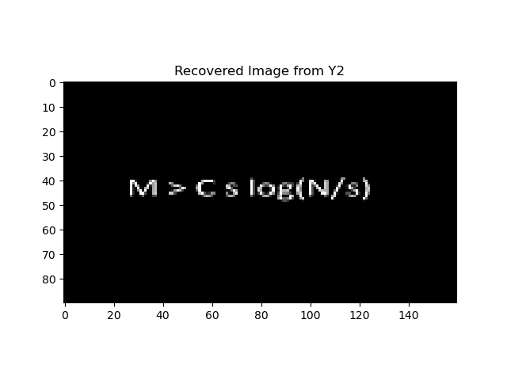
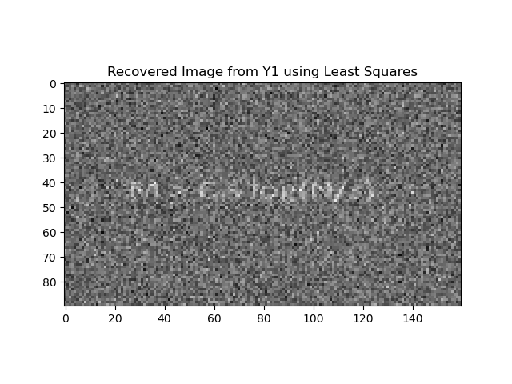
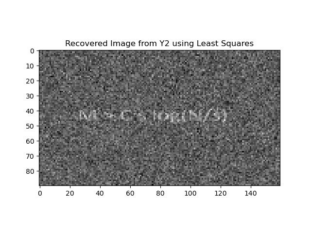
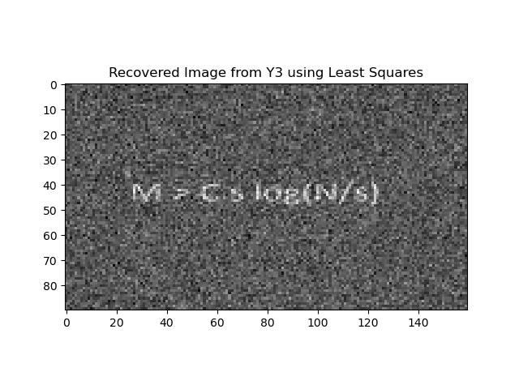

# Mini Project Report

**Shanchuan Hong A69027198**

**Github Link:**

## How to Run

```bash
Structure of the Project:
img/
----noise/
--------Known/
--------Unknown/
----noiseless/
----part5/
--------ls/
--------omp/
logs/
load_data.py
noise.py
noiseless.py
part5.py
part6.py
# part5
# make directory for img//part5//ls// and img//part5//omp//
# change the mat file path in line 30: data = loadmat('Pr5\\Data\\Data.mat')
python part5.py
```

### Part3 and Part4

under the root path, make sure the directories for img/ and logs/ are created.

```img/
img/
----noise/
--------Known/
--------Unknown/
----noiseless/
logs
```

then, run

```bash
python noiseless.py # for part3
python noise.py # for part4
```

### Part5

make sure the directories for img//part5//ls// and img//part5//omp// are existed:

```
img/
----part5/
--------ls/
--------omp/
```

Also, change the mat file path in line 30 of ```part5.py```: ```data = loadmat('path to mat file')```

then, run

```bash
python part5.py
```

### Part6

under line 8 of ```part6.py```, change the folder of files for part6:

```address = 'path to file folder'```

also, make sure to upgrade the Pillow to load the data

then run:

```bash
python part6.py
```


## Part3

## Part4

## Part 5

**a):** No, the compressed images provide no meaningful information at a glance.

**b):**

**Recovery by OMP**

The OMP aims for the sparsest solution, which should represent the original image with high fidelity.

Recovered images using OMP algorithm:






**Recovery by Least Squares Solution**

The Least Squares solution minimizes the overall error in a least squares sense but does not inherently consider the sparsity of the solution, which can lead to less clear results.

Recovered images using Least Squares solution:







Images recovered via the OMP algorithm are markedly better in clarity than those from the Least Squares solution. The OMP recovery results in a cleaner background and more discernible text.

**c)** The best visual result comes from the image recovered from Y3 using OMP. This can be explained by considering the dimensions of the measurement matrices (A1, A2, A3) and their corresponding compressed images (y1, y2, y3):

- A1: (960, 14400), y1: (960, 1)
- A2: (1440, 14400), y2: (1440, 1)
- A3: (2880, 14400), y3: (2880, 1)

The matrix A3 has more rows than A1 and A2, which means it captures more measurements of the original image. This increased number of measurements can result in a better approximation and clearer reconstruction. Furthermore, since OMP's efficacy depends on the match between the measurement matrix and the signal, the larger set of measurements in A3 may enhance the accuracy of atom selection, resulting in a higher quality reconstruction.

## Part 6

**a):** The message within the compressed signal is not discernible. 

**b):** 

code for this part:

```python
K = [10, 50, 100, 200, 300, 1000, 2000, 3000]  
for k in K:
    yk = compressedSignal[:k]
    Ak = compressionMatrix[:k, :]
    ADk = Ak @ D
    sk = omp(ADk, yk, 100) 
    xk = D @ sk
    sd.play(xk, fps)
    sd.wait()  
```

The audit is "I love linear algebra"

Compared to the Least Squares solution, the OMP algorithm provided a clearer and more accurate reconstruction of the original signal. The Least Squares solution, which does not utilize the sparsity of the signal, resulted in a less clear audio that was not as easily interpretable.

**c):** The minimum number of measurements required to understand the message from the reconstructed audio signal, denoted as Kmin, was found to be 200. The determination of Kmin is influenced by several factors:

- The sparsity level of the signal: A higher sparsity level typically requires fewer measurements for signal recovery.
- The size of the signal: A larger signal size could potentially require more measurements to achieve a clear reconstruction.
- The effectiveness of the recovery algorithm: OMP, which exploits sparsity, can recover signals from fewer measurements compared to algorithms like Least Squares that do not utilize sparsity.

Kmin is directly related to the sparsity of s and the size of the signal. Generally, a larger signal or a less sparse signal would require more measurements for accurate recovery. 

Having more measurements than Kmin offers several advantages:
- It may improve the quality of the recovered signal, making the message even clearer.
- It can increase the robustness of the signal recovery to noise and other distortions.
- It provides more information that can potentially be used to refine the recovery algorithm or adapt it to more complex signals.


