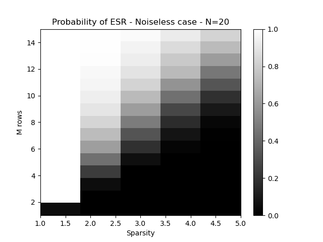
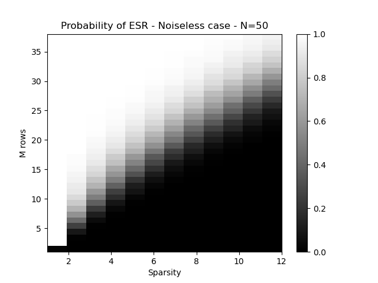
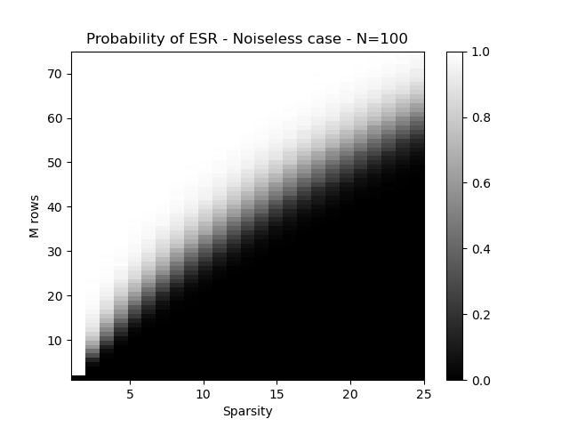
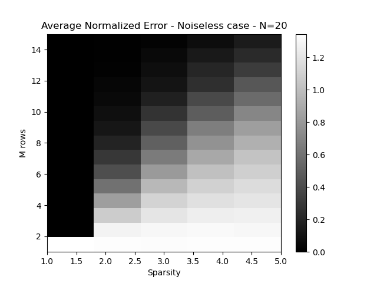
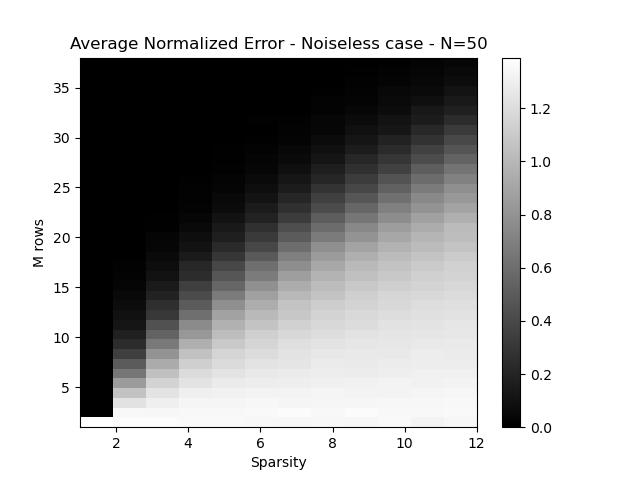
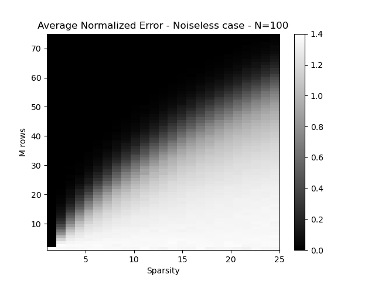

# Mini Project Report

**Shanchuan Hong A69027198**

**contact:** shh050@ucsd.edu (feel free to contact me if you have any questions about this project)

## How to Run

```
Structure of the Project:
img/
----noise/
--------Known/
--------Unknown/
----noiseless/
----part5/
--------ls/
--------omp/
logs/
load_data.py
noise.py
noiseless.py
part5.py
part6.py
```

### Part3 and Part4

under the root path, make sure the directories for img/ and logs/ are created.

```img/
img/
----noise/
--------Known/
--------Unknown/
----noiseless/
logs
```

then, run

```bash
python noiseless.py # for part3
python noise.py # for part4
```

### Part5

make sure the directories for img//part5//ls// and img//part5//omp// are existed:

```
img/
----part5/
--------ls/
--------omp/
```

Also, change the mat file path in line 30 of ```part5.py```: ```data = loadmat('path to mat file')```

then, run

```bash
python part5.py
```

### Part6

under line 8 of ```part6.py```, change the folder of files for part6:

```address = 'path to file folder'```

also, make sure to upgrade the Pillow to load the data

then run:

```bash
python part6.py
```


## Part3 Noiseless 

### Results

#### Probability of Exact Support Recovery (ESR)

Discuss what the ESR plots indicate regarding the number of measurements needed for successful sparse signal recovery as a function of `smax`.

##### N = 20



##### N = 50



##### N = 100



#### Average Normalized Error

Discuss the implications of the average normalized error plots in the context of signal recovery accuracy.

##### N = 20



##### N = 50



##### N = 100



### Discussion

The performance of the Orthogonal Matching Pursuit (OMP) algorithm in the noiseless case has been extensively evaluated through the generation of phase transition plots for both the Probability of Exact Support Recovery (ESR) and Average Normalized Error. These plots offer a visual representation of the algorithm's effectiveness in identifying the exact support of sparse signals.

#### Probability of Exact Support Recovery (ESR)

The ESR plots for N=20, N=50, and N=100 demonstrate a distinct pattern that correlates the probability of exact support recovery with the sparsity and number of measurements. A clear transition region can be observed across all values of N, where the probability of ESR shifts from values close to 1, indicating a high success rate, to values nearing 0, suggesting failure in support recovery. This transition becomes sharper and moves toward lower values of M (measurements) as N increases, suggesting that a larger signal size N requires proportionally fewer measurements for successful recovery, relative to its sparsity level.

#### Average Normalized Error

Conversely, the Average Normalized Error plots provide insight into the precision of the recovered signal. The trend observed across different values of N indicates that as the number of measurements M increases, the average error decreases. This is consistent with the theoretical understanding that more measurements contribute to a more accurate reconstruction of the signal. The rate of decrease in error as a function of M and sparsity showcases the algorithm's sensitivity to these parameters.

## Part4 Noise Condition

### (a) Sparsity is Known

#### Result

##### ESR:

###### N=20


###### N=50


###### N=100


##### Normalized Error:
###### N=20


###### N=50


###### N=100


#### Comments

The experiments demonstrate that the OMP algorithm's performance in the noisy environment is highly dependent on the noise level ``sigma`` and the signal size ``N``. At a lower noise level ``sigma = 0.001``, there is a higher success rate in support recovery across various sparsity levels, which diminishes as the noise level increases ``sigma = 0.1``. This decrease is more pronounced at higher sparsity levels, indicating a reduced robustness of OMP in the presence of significant noise.

The Normalized Error plots reinforce that accurate signal recovery in a noisy context requires both the knowledge of sparsity and a sufficient number of measurements, especially as the signal size increases. As ``N`` grows, the number of measurements needed to achieve a low error rate also increases, reflecting the necessity for more data to counteract the effects of noise.

In essence, while OMP is quite effective in low noise scenarios, the transition plots emphasize the importance of optimizing measurement quantity and managing noise levels to maintain high accuracy in signal reconstruction, especially for larger signals.

### (b) Sparsity is NOT Known

#### Result

##### ESR:

###### N=20


###### N=50


###### N=100


##### Normalized Error:
###### N=20


###### N=50


###### N=100


### Comments

In the noisy case where sparsity is not known, the OMP algorithm shows varying degrees of performance based on the noise level and the number of measurements. The ESR plots indicate that with a lower noise level, the algorithm has a moderate success rate across various sparsity levels, but as expected, this success rate drops with higher noise. This highlights the challenge of sparsity-agnostic recovery in noisy environments. For the Normalized Error, the low-noise scenario maintains a generally lower error, suggesting that the stopping criterion is somewhat effective when noise levels are minimal. However, in the high-noise scenario, the error is noticeably higher, which shows the limitations of using a fixed noise-based stopping criterion. These plots confirm that while it is possible to recover signals without knowing their exact sparsity, doing so becomes increasingly difficult as the noise level rises. Overall, these results suggest that while the OMP can adapt to unknown sparsity by using the known noise level as a stopping criterion, the accuracy of the recovery is compromised as the noise level increases. The algorithm's performance in unknown sparsity conditions reinforces the importance of accurate noise estimation and the necessity for a robust approach when dealing with real-world data where sparsity is not always known a priori.

## Part 5 Decode Image

**a):** No, the compressed images provide no meaningful information at a glance.

**b):**

**Recovery by OMP**

The OMP aims for the sparsest solution, which should represent the original image with high fidelity.

Recovered images using OMP algorithm:


**Recovery by Least Squares Solution**

The Least Squares solution minimizes the overall error in a least squares sense but does not inherently consider the sparsity of the solution, which can lead to less clear results.

Recovered images using Least Squares solution:


Images recovered via the OMP algorithm are markedly better in clarity than those from the Least Squares solution. The OMP recovery results in a cleaner background and more discernible text.

**c)** The best visual result comes from the image recovered from Y3 using OMP. This can be explained by considering the dimensions of the measurement matrices (A1, A2, A3) and their corresponding compressed images (y1, y2, y3):

- A1: (960, 14400), y1: (960, 1)
- A2: (1440, 14400), y2: (1440, 1)
- A3: (2880, 14400), y3: (2880, 1)

The matrix A3 has more rows than A1 and A2, which means it captures more measurements of the original image. This increased number of measurements can result in a better approximation and clearer reconstruction. Furthermore, since OMP's efficacy depends on the match between the measurement matrix and the signal, the larger set of measurements in A3 may enhance the accuracy of atom selection, resulting in a higher quality reconstruction.

## Part 6 Decode Audit

**a):** The message within the compressed signal is not discernible. 

**b):** 

code for this part:

```python
K = [10, 50, 100, 200, 300, 1000, 2000, 3000]  
for k in K:
    yk = compressedSignal[:k]
    Ak = compressionMatrix[:k, :]
    ADk = Ak @ D
    sk = omp(ADk, yk, 100) 
    xk = D @ sk
    sd.play(xk, fps)
    sd.wait()  
```

**The audit is "I love linear algebra"**

Compared to the Least Squares solution, the OMP algorithm provided a **clearer** and more **accurate** reconstruction of the original signal. The Least Squares solution, which does not utilize the sparsity of the signal, resulted in a less clear audio that was not as easily interpretable.

**c):** The minimum number of measurements required to understand the message from the reconstructed audio signal, denoted as Kmin, was found to be 200. The determination of Kmin is influenced by several factors:

- The sparsity level of the signal: A higher sparsity level typically requires fewer measurements for signal recovery.
- The size of the signal: A larger signal size could potentially require more measurements to achieve a clear reconstruction.
- The effectiveness of the recovery algorithm: OMP, which exploits sparsity, can recover signals from fewer measurements compared to algorithms like Least Squares that do not utilize sparsity.

Kmin is directly related to the sparsity of s and the size of the signal. Generally, a larger signal or a less sparse signal would require more measurements for accurate recovery. 

Having more measurements than Kmin offers several advantages:
- It may improve the quality of the recovered signal, making the message even clearer.
- It can increase the robustness of the signal recovery to noise and other distortions.
- It provides more information that can potentially be used to refine the recovery algorithm or adapt it to more complex signals.

**d): **

The construction of the basis \( D \) that allows for a sparse representation of the audio signal \( x \) likely leverages a transformation known to produce sparse coefficients for signals with certain characteristics. 

To construct such a basis \( D \), we could start with a broad class of functions that we believe to represent the signal well, like wavelets or DCT bases for audio signals. We can then refine this set using dictionary learning algorithms to adapt the basis to the particular characteristics of the signal \( x \). These algorithms iteratively adjust the basis elements to better match the data, leading to a more sparse representation.

In essence, the choice of basis \( D \) is highly dependent on the nature of the audio signal \( x \). If the signal characteristics are known, one could tailor the basis to exploit these features for sparsity. 


